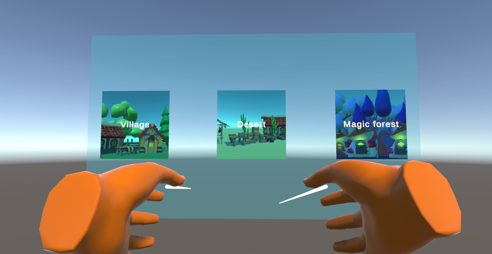
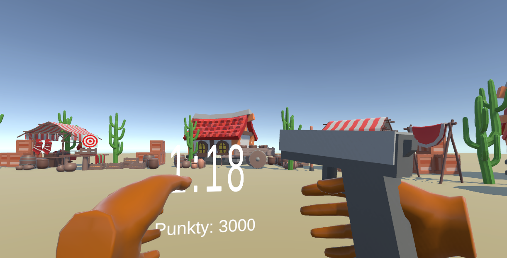
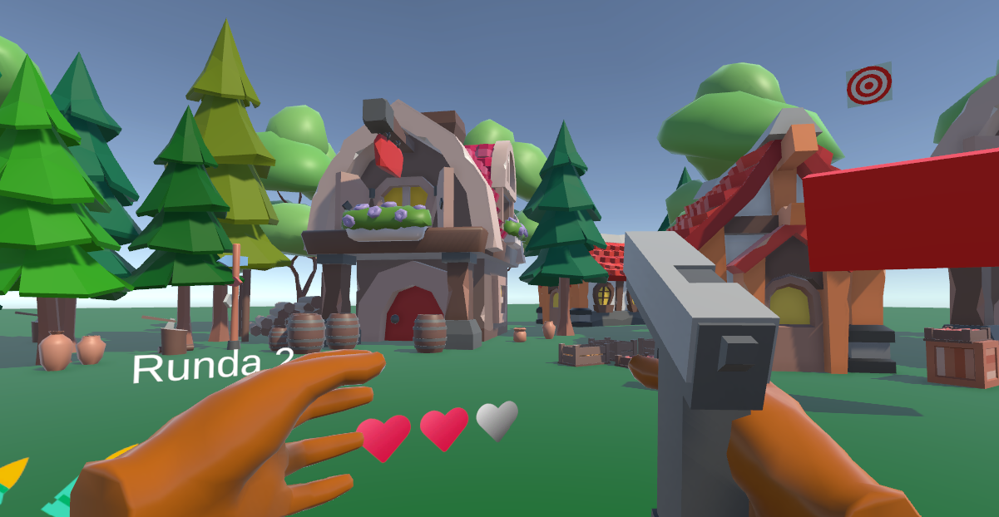

# DuckHuntVR

**DuckHuntVR** is a student VR game project inspired by the classic *Duck Hunt* game, developed in **Unity** as part of the *VR and AR* course.

---

## 📌 Project Overview

The game is a VR adaptation of the Duck Hunt concept and features two gameplay modes designed to test both accuracy and reaction time.

---

## 🎮 Game Modes

### Normal Mode
A classic Duck Hunt–style gameplay mode.  
The player must shoot down a fixed number of targets using a limited magazine.  
After the ammunition is depleted or a set amount of time passes, the game checks whether all targets have been destroyed.  
If not, the player loses a life.

### Time Mode
A score-based mode focused on achieving the highest possible score.  
As time passes, the number of targets increases, gradually raising the difficulty level.

---

## 🎨 Visual Style

The game features a **Low Poly** visual style.  
All assets used in the project were downloaded as **free assets from the Unity Asset Store**.

---

## 🛠️ Technologies Used

- **Unity 2022.3.55f1**
- **C#**
- VR - XR Interaction Toolkit

---

## VR Support

- **HTC Vive Pro**
- **Meta Quest**
- **SteamVR-compatible devices**

---

## 📦 Repository Content

The repository contains:
- the full **Unity project**
- a **ready-to-run game build**

---

### Menu - mode selection

### Time mode

### Normal mode

---

*This project was created as a student assignment for a university course on VR and AR.*
